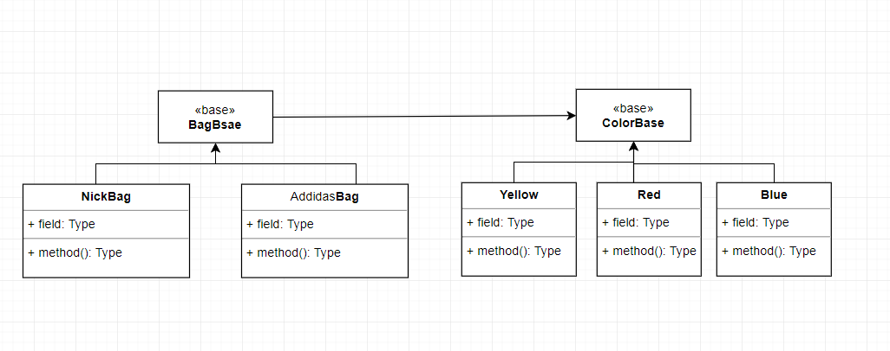

# 橋接模式(BridgePattern)

目的：
如果有兩大類模組是多對多的組合，如本次Smaple Code. Nick和Addidas 包包都有紅、藍、黃....或其他顏色

就可能呈現下面6種組合

* Nick(紅)
* Nick(藍)
* Nick(黃)
* Addidas(紅)
* Addidas(藍)
* Addidas(黃)

如果此建立類別的話 可能情況如下面的UNL圖 


> 類別數量 = 顏色數量 * 包包品牌數量

這樣會有兩個問題

1. 隨著品牌和顏色增多，包包類別數量急速增長　**(X = m*n)個** 
2. 顏色我們可看做一個抽象 不應當和包包合在一起

其中的第二點我覺得最重要

這時候就很適合帶入我們的主角**BridgePattern**

----

## 範例介紹

關係變成下圖UML



我們可以看到`BagBsae`去引用`ColorBase` 可以看到我們所需的子類別變成五個而已,重點是類別關係變得更有條理了，顏色和包包分開可調整性更大。

OOP有一個很重要的設計觀念 
> 盡量用組合取代繼承，因為繼承耦合性遠大於組合！

因為子類別繼承父類別，子類別無條件都擁有protect已上的方法或成員資料.這就會造成一個耦合性(使用繼承須看情況)，而A類別對於B類別進行組合就可達到繼承效果但不造成像繼承般的強耦合.

我們的背包一樣可擁有多種顏色，但耦合度跟類別關係變得更清晰了。

-----

## 程式碼解說

建立 `BagBase` 類別並將 `ColorBase` 當建構傳入(因為`Bag`需要上顏色)

```c#
public abstract class BagBase
{
    protected ColorBase color{ get; set; }

    public BagBase(ColorBase color) {
        this.color = color;
    }
    public abstract void GetBag();
}

public abstract class ColorBase
{
    public abstract string Color();
}
```

這邊我只介紹一種顏色和包包來當作範例,因為其他概念都一樣

```c#
public class AdidasBag : BagBase
{
    public AdidasBag(ColorBase color) : base(color)
    {
    }

    public override void GetBag()
    {
        Console.WriteLine($"It is Addidas Bag,Color is {color.Color()}");
    }
}

class ColorBlue : ColorBase
{
    public override string Color()
    {
        return "Blue";
    }
}
```

建立
*  `AdidasBag`類別重載`GetBag`方法
*  `ColorBlue`類別重載`Color`方法

因為`BagBase`要傳入顏色`GetBag`就可幫包包上色.

使用如下外面看起來很合理乾淨.

```c#
class Program
{
    static void Main(string[] args)
    {
        AdidasBag nick = new AdidasBag(new ColorBlue());
        nick.GetBag();
        Console.ReadKey();
    }
}
```
----

## 實際案例

前陣子在做一個Unity2D遊戲，遇到一組遊戲邏輯

一個人物要移動有分兩種移動方式
1. 自動移動
2. 玩家手動點擊移動

因為是2D遊戲 有 `上下左右` 四個方位移動,四個方位配上兩個移動方式,人物會有不一樣的移動邏輯.

這邊我貼上部分程式碼

建立一個 `RoadActionBase`裡面有三個必要屬性需要給 `上下左右` 實現

1. `ArrowType` 2D人物移動箭頭方向
2. `OffSetPos` 移動距離
3. `PlayerDirction` 這是一個Unity2D座標屬性

```c#
public abstract class RoadActionBase 
{

    protected int _level;

    public RoadActionBase()
    {
        _level = SenceParamter.RoadCount;
    }

    public abstract ArrowType ArrowType { get; }

    public abstract int OffSetPos { get; }

    public abstract Vector2 PlayerDirction { get; }
}
```

`UpRoadAction`類別對於往`上`時的狀態做給值

```c#
public class UpRoadAction : RoadActionBase
{
    public override ArrowType ArrowType
    {
        get
        {
            return ArrowType.Up;
        }
    }

    public override int OffSetPos
    {
        get
        {
            return -_level;
        }
    }

    public override Vector2 PlayerDirction
    {
        get
        {
            return Vector2.up;
        }
    }
}
```

`DownRoadAction`類別對於往`下`時的狀態做給值

```c#
public class DownRoadAction : RoadActionBase
{
    public override ArrowType ArrowType
    {
        get
        {
            return ArrowType.Down;
        }
    }

    public override int OffSetPos
    {
        get
        {
            return _level;
        }
    }

    public override Vector2 PlayerDirction
    {
        get
        {
            return Vector2.down;
        }
    }
}
```

`RightRoadAction`類別對於往`右`時的狀態做給值

```c#
public class RightRoadAction : RoadActionBase
{
    public override ArrowType ArrowType
    {
        get
        {
            return ArrowType.Right;
        }
    }

    public override int OffSetPos
    {
        get
        {
            return 1;
        }
    }

    public override Vector2 PlayerDirction
    {
        get
        {
            return Vector2.right;
        }
    }
}
```


`LeftRoadAction`類別對於往`左`時的狀態做給值

```c#
public class LeftRoadAction : RoadActionBase
{
    public override ArrowType ArrowType
    {
        get
        {
            return ArrowType.Left;
        }
    }

    public override int OffSetPos
    {
        get
        {
            return -1;
        }
    }

    public override Vector2 PlayerDirction
    {
        get
        {
            return Vector2.left;
        }
    }
}
```

建立一個 `MoveBase` 並將 `RoadActionBase`當作建構子傳入(內部邏輯有寫注解).

> 重點在於一個 `IsWalkNext`方法 提供Hock給子類別做實現,因為手動和自動移動邏輯不一樣.

```c#
/// <summary>
/// 橋接模式
/// </summary>
public abstract class MoveBase
{
    protected PlayerController _player;

    protected int _level;

    protected float _Scape;

    public RoadActionBase RoadAction { get; protected set; }

    public MoveBase(RoadActionBase roadAction)
    {
        _player = PlayerController.Instance;
        _level = SenceParamter.RoadCount;
        _Scape = SenceParamter.Scape + SenceParamter.RoadHeigh;
        RoadAction = roadAction;
    }

    public virtual void Move(RoadContext currentRoad, RoadContext nextRoad)
    {
        //取得下一個位置
        Vector2 nextPos = nextRoad.transform.localPosition;

        if (IsWalkNext(currentRoad, nextRoad, _player.targetPos, nextPos))
        {
            //將下一個資料塞給當前玩家
            _player.targetPos = nextPos;
            _player.RoadContext = nextRoad;
            _player.moveDirction = RoadAction.PlayerDirction;

            currentRoad.SetIsWalk(true);

            //加入等待轉換的地方
            ReloadRoadController.Instance.AddRoadContext(currentRoad);
        }
    }

    protected abstract bool IsWalkNext(RoadContext currentRoad, RoadContext nextRoad, Vector3 targetPos, Vector3 nextPos);
}
```
`TouchMove` 類別重載 `IsWalkNext`實現自己的邏輯

```c#
public class TouchMove : MoveBase
{
    public TouchMove(RoadActionBase roadAction) : base(roadAction)
    {
    }

    /// <summary>
    /// 判斷是否可以 前往下一個目標
    /// </summary>
    /// <param name="currentRoad"></param>
    /// <param name="nextRoad"></param>
    /// <param name="targetPos"></param>
    /// <param name="nextPos"></param>
    /// <returns></returns>
    protected override bool IsWalkNext(RoadContext currentRoad, RoadContext nextRoad, Vector3 targetPos, Vector3 nextPos)
    {
        ArrowType arrowType = RoadAction.ArrowType;
        //1.下一個道路要可以進去
        //2.當前道路要可以出來
        //3.必須為四周的道路
        return
            arrowType.CanWalk(currentRoad.CanWalkOut) &&
            arrowType.CanWalk(nextRoad.CanWalkIn) &&
            CanMoveNextPos(targetPos, nextPos);

    }

    private bool CanMoveNextPos(Vector3 targetPos, Vector3 nextPos)
    {
        return ((int)Vector2.Distance(targetPos, nextPos)) % 
            ((int)_Scape) == 0;
    }
}
```
`AutoMove` 類別重載 `IsWalkNext`實現自己的邏輯

```c#
public class AutoMove : MoveBase
{
    public AutoMove(RoadActionBase roadAction) : base(roadAction)
    {
    }

    /// <summary>
    /// 判斷是否可以 前往下一個目標
    /// </summary>
    /// <param name="currentRoad"></param>
    /// <param name="nextRoad"></param>
    /// <param name="targetPos"></param>
    /// <param name="nextPos"></param>
    /// <returns></returns>
    protected override bool IsWalkNext(RoadContext currentRoad, RoadContext nextRoad, Vector3 targetPos, Vector3 nextPos)
    {
        //1.下一個道路要可以進去
        //2.當前道路要可以出來
        //3.必須為四周的道路
        //4.步數必須大於0
        return
                currentRoad.CurrentArrow.CanWalk(nextRoad.CanWalkIn) &&
                currentRoad.CurrentArrow.CanWalk(currentRoad.CanWalkOut) &&
                CanMoveNextPos(targetPos, nextPos) &&
                !nextRoad.IsChangeState && 
                GameModel.Step >0;
    }

    private bool CanMoveNextPos(Vector3 targetPos, Vector3 nextPos)
    {
        return ((int)Vector2.Distance(targetPos, nextPos)) % 
            ((int)_Scape) == 0;
    }
}
```


上面程式碼最主要是跟大家分享移動方式和方位的關係,`上下左右`值和方位式固定,將此配上不同的移動方式有不一樣的邏輯.