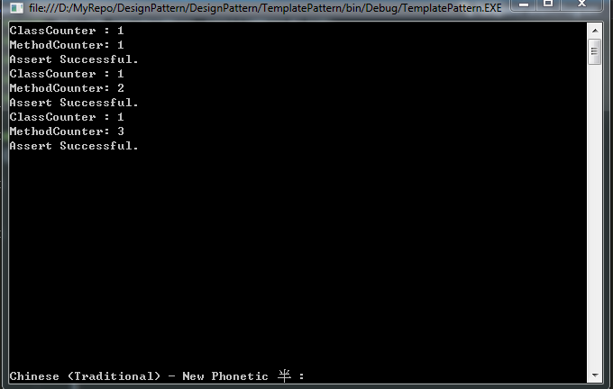

# 樣板模式(TemplatePattern)

如果目前場景遇到一定流程階段，但流程內容依照邏輯或情境不同也有所不一樣.
這時可以考慮使用**樣板模式(TemplatePattern)**

-----

## 生活舉例：

因為十二年國教，所以基本上每個人都有上學的經驗

每天上學最少要經歷下面過程(我做一些簡化)

> 到學校=>上午上課=>吃午餐=>下午上課=>放學回家

可以看到不管是國小、國中、高中 至少都有上述的過程

但每個過程內容可能會依照年級階段不同，也有所不一樣

例如：
* 吃中餐：高中可能是吃便當，但國小是吃營養午餐，雖然都是吃飯但內容不一樣。
* 上午上課：都是教數學，但高中教微積分，國小教加減乘除。
  
> 重點:流程雖一樣但細部邏輯交由學校去實施實現

-----

## 常見例子：

我們常見的測試框架 `MSTest,NUnit.....` 都有樣板模式的思想。

一般來說測試框架都有**生命週期**，只是每個框架命名不一樣但核心原理差不多

1. SetUpClass (每個測試類別只都執行一次)
2. SetUpUnitTest (每次執行測試方法時都執行一次)
3. UnitTest (執行測試方法)


**如下圖**


(圖片來自網路上)

-----

範例：

此範例使用Console來模擬單元測試框架流程：

建立一個 `UnitFlowBase` 抽像類別，裡面有三個方法

1. SetUpClass (每個測試類別只都執行一次)
2. SetUpUnitTest (每次執行測試方法時都執行一次)
3. UnitTest (執行測試方法)

此抽象類別提供3個Hock讓子類實做細節。
`UnitFlowBase`只提供框架

```c#
public abstract class UnitFlowBase
{
    protected UnitFlowBase()
    {
        SetUpClass();
    }

    protected virtual void SetUpClass()
    {
    }

    protected virtual void SetUpUnitTest()
    {
    }

    protected abstract bool Execute();

    public void UnitTest()
    {
        SetUpUnitTest();
        Console.WriteLine(Execute() ? "Assert Successful." : "Assert Fail.");
    }
}
```

建立另一個類別`UnitCounter` 實現那三個方法
特別是`Execute`方法 我顯示目前 `ClassCount` 跟 `MethodCount` 執行次數

```C#
public class UnitCounter : UnitFlowBase
{
    private int _classCounter = 0;

    private int _methodCounter = 0;

    protected override void SetUpClass()
    {
        _classCounter++;
    }

    protected override void SetUpUnitTest()
    {
        _methodCounter++;
    }

    protected override bool Execute()
    {
        Console.WriteLine($"ClassCounter : {_classCounter}");
        Console.WriteLine($"MethodCounter: { _methodCounter}");

        return true;
    }
}
```

呼叫實我們建立一個`UnitCounter`類別，但執行三次`UnitTest`方法

```C#
class Program
{
    static void Main(string[] args)
    {
        UnitCounter unitMock = new UnitCounter();
        unitMock.UnitTest();
        unitMock.UnitTest();
        unitMock.UnitTest();

        Console.ReadKey();
    }
}
```

執行結果如下圖：



雖然執行3次 `UnitTest` 方法 但 `ClassCounter` 值卻一直是1而 `MethodCounter` 會依照執行幾次就加幾次.

------

# 小結:

日後測試程式只需關注我們需要如何實現邏輯細解（重寫三個方法），核心流程順序就交由`UnitFlowBase`決定。
